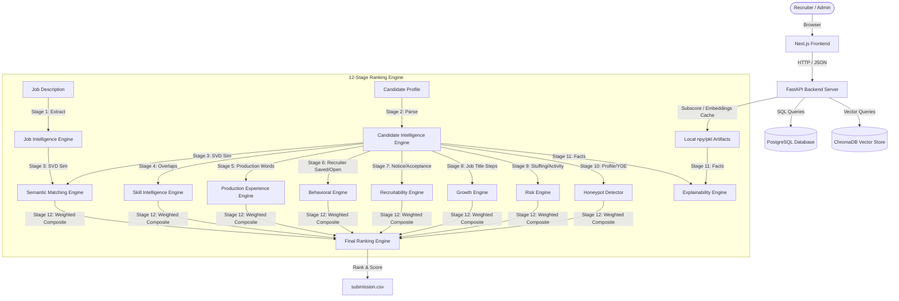

# HireMind AI - System Design and Architecture Documentation

HireMind AI is a production-grade candidate discovery, intelligence, and ranking platform built for the India Runs Challenge. It leverages local TF-IDF + SVD semantic search, a 12-stage candidate scoring pipeline, and a Next.js/FastAPI full-stack architecture.

---

## 1. System Architecture Diagram

---

## 2. The 12-Stage Ranking Pipeline

The ranking system executes the following modules sequentially:

1. **Job Intelligence Engine**: Parses the job description (docx or raw text) to extract structural requirements (Title, Required Skills, Nice-To-Have Skills, Target Experience Band, Disqualifiers, Work Mode, Location).
2. **Candidate Intelligence Engine**: Normalizes and cleans candidates' summary, profile, skills, education, and career history into a unified textual representation for embedding representation.
3. **Semantic Matching Engine**: Generates cosine similarity scores between the Job Description embedding and Candidate Profile embeddings using local TF-IDF + TruncatedSVD projection.
4. **Skill Intelligence Engine**: Maps declared candidate skills against the JD requirement keywords. Weights specific skills (e.g. `fastapi`, `ndcg`, `vector search`) higher, accounting for proficiency level and duration of usage.
5. **Production Experience Engine**: Analyzes career history description texts to detect evidence of production-level operations, scalability, serving, deployment, and monitoring.
6. **Behavioral Intelligence Engine**: Generates a behavior score using platform signals (GitHub activity, search appearances, profile views, times saved by recruiters).
7. **Recruitability Engine**: Approximates the candidate's hiring likelihood based on response rates, notice periods, and offer acceptance rate history.
8. **Growth Engine**: Traces sequential career title levels (e.g. Intern -> Junior -> Senior -> Lead/Principal) to calculate title progression and progressive tenure stability.
9. **Risk Engine**: Detects red flags like extremely low recruiter response, massive notice periods, stale activity, and low profile completeness.
10. **Honeypot Detector**: Catches fraudulent profiles by identifying inconsistencies (e.g. years of experience exceeding career history duration, multiple expert skills with zero months duration, graduation year conflicts).
11. **Explainability Engine**: Combines matching metrics, production evidence, and risk analysis to generate high-fidelity, human-readable recruiter reasons.
12. **Final Ranking Engine**: Computes the composite weighted score and sorts the candidates descending by score and ascending by candidate ID.

---

## 3. Database Schema

The production-grade PostgreSQL/Supabase database schema consists of the following tables:

### Users Table (`users`)
Stores recruiter and administrator login credentials.
- `id` (INTEGER, Primary Key, Auto-increment)
- `username` (VARCHAR, Unique, Indexed)
- `hashed_password` (VARCHAR)
- `role` (VARCHAR, Default: `'recruiter'`)

### Job Descriptions Table (`job_descriptions`)
Stores uploaded roles.
- `id` (INTEGER, Primary Key, Auto-increment)
- `title` (VARCHAR)
- `raw_text` (TEXT)
- `extracted_skills` (JSON)
- `extracted_experience` (VARCHAR)
- `extracted_education` (VARCHAR)
- `extracted_certifications` (JSON)
- `extracted_responsibilities` (JSON)
- `is_active` (BOOLEAN, Default: `true`)

### Candidates Table (`candidates`)
Stores parsed candidate profiles, precomputed subscores, and ranking results.
- `candidate_id` (VARCHAR, Primary Key, Indexed)
- `profile_data` (JSON)
- `score` (FLOAT, Default: `0.0`)
- `semantic_score` (FLOAT, Default: `0.0`)
- `skill_score` (FLOAT, Default: `0.0`)
- `experience_score` (FLOAT, Default: `0.0`)
- `education_score` (FLOAT, Default: `0.0`)
- `behavioral_score` (FLOAT, Default: `0.0`)
- `production_score` (FLOAT, Default: `0.0`)
- `recruitability_score` (FLOAT, Default: `0.0`)
- `growth_score` (FLOAT, Default: `0.0`)
- `risk_score` (FLOAT, Default: `0.0`)
- `is_honeypot` (BOOLEAN, Default: `false`)
- `is_disqualified` (BOOLEAN, Default: `false`)
- `disqualification_reason` (VARCHAR)
- `rank` (INTEGER, Nullable)
- `reasoning` (TEXT, Nullable)
- `years_of_experience` (FLOAT, Default: `0.0`)
- `current_title` (VARCHAR)
- `current_company` (VARCHAR)
- `location` (VARCHAR)
- `skills_list` (JSON)

---

## 4. API Specifications

All endpoints are prefixed with `/api`:

### Auth Endpoints
- `POST /api/auth/signup`: Registers a new user.
- `POST /api/auth/login`: Validates credentials and returns a JWT access token.

### Candidate Endpoints
- `GET /api/candidates`: Lists all candidates with pagination, text search, experience, and location filters.
- `GET /api/candidates/detail/{id}`: Returns a candidate's complete profile and score details.
- `GET /api/candidates/analytics`: Returns aggregated candidate demographics, skill frequency, and experience distributions.

### Job/Ranking Endpoints
- `POST /api/jobs/upload`: Uploads a job description docx or raw text.
- `POST /api/jobs/rank`: Runs the FAISS retrieval and 12-stage DNA ranking engine. Updates the SQLite/PostgreSQL database with the ranks, scores, and explanations.
- `GET /api/jobs/top-candidates`: Returns the top-k ranked candidates.
- `GET /api/jobs/export/submission`: Exports the top-100 ranked candidates in the official challenge-spec CSV format.
